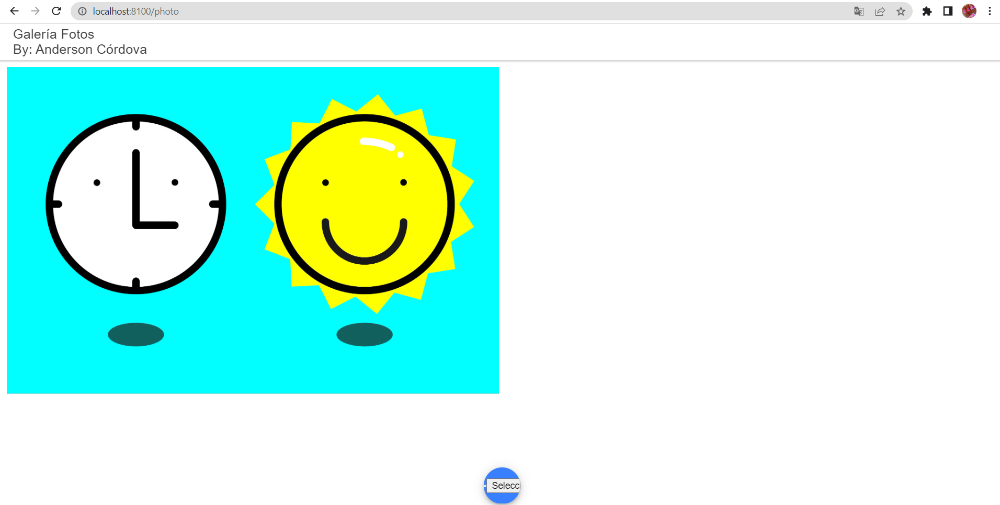
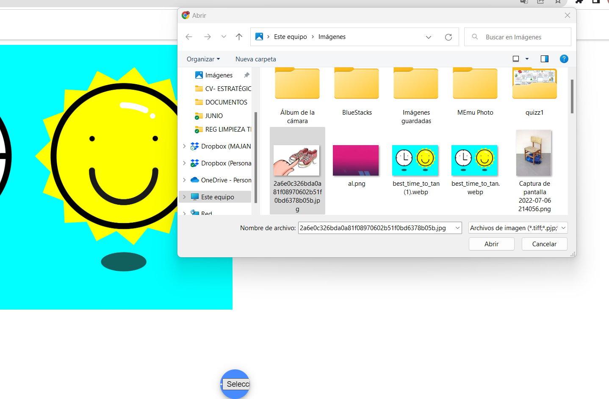
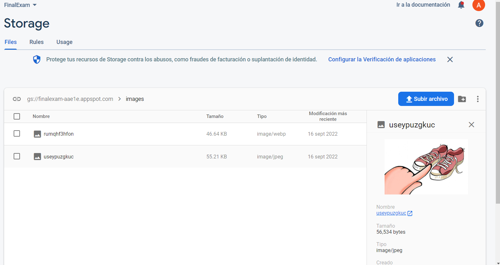

# Galería Fotos

Aplicativo de galería que permite tomar fotos y almacenarlo en Firebase implemntado con Ionic//Angular

funcionamiento -->
<br />


<br />

### App Ionic Angular incluye:

- Galery Photos
- Ionicons
- Conecction with Firebase

### To run

```javascript
npm install
ionic serve
```

## Delete image

<br />
La galería es iteractiva 
<br />


<br />

## Upload image


<br />

## Update in real time


## Save photos in Firebase



<br />

## Thakns for view
